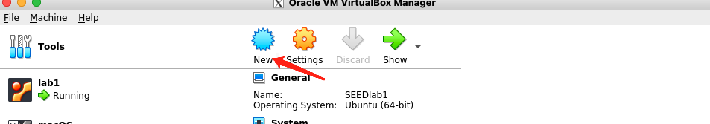
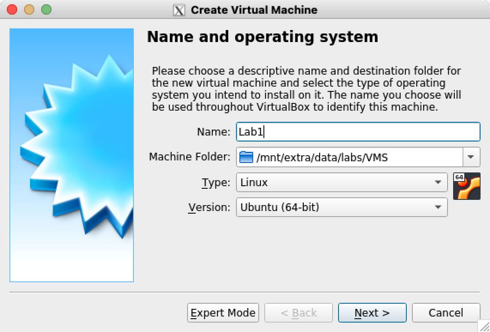
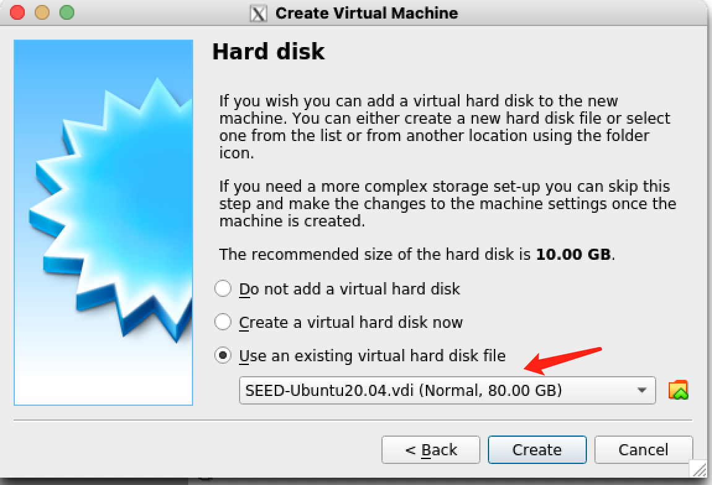
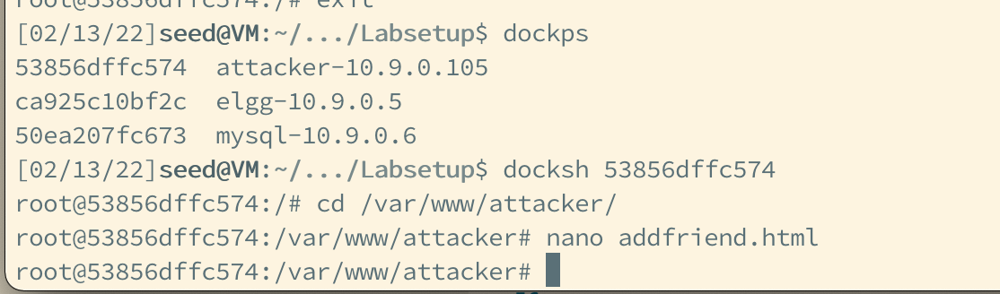
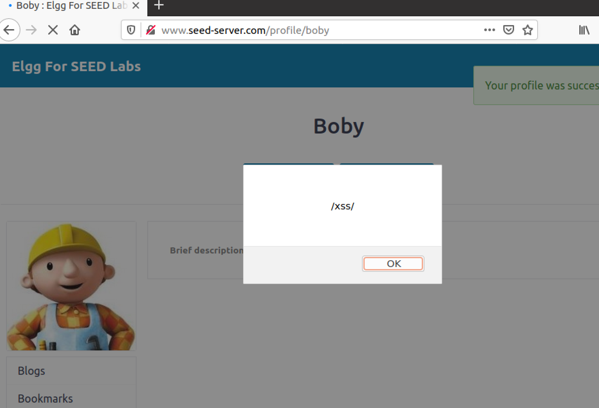
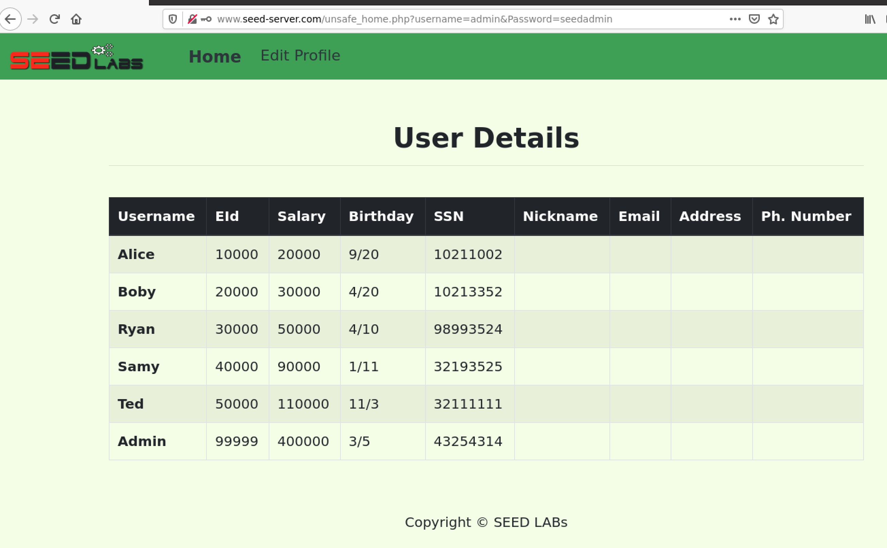

# Web Security Lab

## Credits
The tasks posted in this repo are borrowed from the SEED Labs: https://seedsecuritylabs.org/labs.html. The credits go to Prof. Wenliang Du and his group at Syracuse.

## Setup 

(For VMWare user, please refer to "VMWareSetup.md" )

1. Install [VirtualBox](https://www.virtualbox.org/wiki/Downloads);
2. Download a pre-built SEED VM from [Google Drive](https://drive.google.com/file/d/138fqx0F8bThLm9ka8cnuxmrD6irtz_4m/view?usp=sharing) or [Direct Download Link](https://seed.nyc3.cdn.digitaloceanspaces.com/SEED-Ubuntu20.04.zip)
3. Create a new VM from the pre-built VM disk.

### The VM's USERNAME: seed, PASSWORD: dees

### Create a lab VM

* Open the VirtualBox, click "New"



* Create a Virtual Machine as the picture shows



* Choose the "Use an existing virtual hard disk file" , and the hard disk file is the pre-built VM disk file downloaded above. 



* Start the Virtual Machine

### Set up the Web Security environment (XSS)

Inside the Lab VM:

1. Open a Terminal
2. Download the required file: `wget --no-check-certificate -c https://seedsecuritylabs.org/Labs_20.04/Files/Web_XSS_Elgg/Labsetup.zip`
3. Run `unzip Labsetup.zip && cd Labsetup`
4. Edit the hosts file, and add a line at the end of the `/etc/hosts` file, eg: `echo 10.9.0.5        www.seed-server.com | sudo tee -a /etc/hosts `
5. Run `docker-compose up -d`
6. Open a browser, and visit `www.seed-server.com`
7. Username:`alice`, Password: `seedalice`; or Username: `boby`, Password: `seedboby`

### Set up the Web Security environment (CSRF)

Inside the Lab VM:

1. Open a Terminal
2. Download the required file: `wget --no-check-certificate -c https://seedsecuritylabs.org/Labs_20.04/Files/Web_CSRF_Elgg/Labsetup.zip`
3. Run `unzip Labsetup.zip && cd Labsetup`
4. Edit the hosts file, and add a line at the end of the `/etc/hosts` file, eg: `echo 10.9.0.5        www.seed-server.com | sudo tee -a /etc/hosts `; `echo 10.9.0.5 www.example32.com | sudo tee -a /etc/hosts`; `echo 10.9.0.105 www.attacker32.com | sudo tee -a /etc/hosts`
5. Run `docker-compose up -d`
6. Open a browser, and visit `www.seed-server.com`
7. Username:`alice`, Password: `seedalice`; or Username: `samy`, Password: `seedsamy`
8. Edit the attacker's pages: run `dockps` to check the container "attacker"'s id, and use `docksh <container id>` to edit attacker's html inside a container. eg:

```bash
[02/13/22]seed@VM:~/.../Labsetup$ dockps
53856dffc574  attacker-10.9.0.105
ca925c10bf2c  elgg-10.9.0.5
50ea207fc673  mysql-10.9.0.6
[02/13/22]seed@VM:~/.../Labsetup$ docksh 53856dffc574
root@53856dffc574:/# cd /var/www/attacker/
root@53856dffc574:/var/www/attacker# nano addfriend.html
```




### Set up the Web Security environment (SQLi)

Inside the Lab VM:

1. Open a Terminal
2. Download the required file: `wget --no-check-certificate -c https://seedsecuritylabs.org/Labs_20.04/Files/Web_SQL_Injection/Labsetup.zip`
3. Run `unzip Labsetup.zip && cd Labsetup`
4. Edit the hosts file, and add a line at the end of the `/etc/hosts` file, eg: `echo 10.9.0.5        www.seed-server.com | sudo tee -a /etc/hosts `
5. Run `docker-compose up -d`
6. Open a browser, and visit `www.seed-server.com`
7. Username:`alice`, Password: `seedalice`; or Username: `admin`, Password: `seedadmin`


## Discover XSS vulnerabilities

### Task 1: Display an Alert Window when visiting a user's profile

You can edit Boby's profile from this link: `http://www.seed-server.com/profile/boby/edit`

Make some changes, so that an Alert Window will be prompted:



### Task 2: Stealing Cookies from the Victim’s Machine

Boby commented on a post of Alice, when Alice views the comment, Alice's cookie will be stolen. 

You may need to write some Javascript code to send the victim's cookie to your server


## Discover CSRF vulnerabilities

### Task 1: CSRF Attack using GET Request

Alice and Samy. Samy wants to become a friend to Alice, but Alice refuses to add him to her Elgg friend list. Samy decides to use the CSRF attack to
achieve his goal. He sends Alice an URL (via an email or a posting in Elgg); Alice, curious about it, clicks on the URL, which leads her to Samy’s web site: `www.attacker32.com`. Pretend that you are Samy, describe how you can construct the content of the web page, so as soon as Alice visits the web page, Samy is added to the friend list of Alice (assuming Alice has an active session with Elgg).

You need to edit the `addfriend.html` insider the `attacker-10.9.0.105` container, and the page can be accessed from `http://www.attacker32.com/addfriend.html`

### Task 2: CSRF Attack using POST Request

Samy plans to use a CSRF attack to modify Alice's profile.


## Discover SQLi vulnerabilities

### Task 1: SQL Injection Attack on SELECT Statement

The PHP code unsafe home.php is located in the `/var/www/SQL_Injection directory`.

```bash
[02/13/22]seed@VM:~$ docker ps
CONTAINER ID        IMAGE                   COMMAND                  CREATED             STATUS              PORTS                 NAMES
3abc9ed9486b        seed-image-www-sqli     "/bin/sh -c 'service…"   9 minutes ago       Up 9 minutes                              www-10.9.0.5
5dcc12432c92        seed-image-mysql-sqli   "docker-entrypoint.s…"   9 minutes ago       Up 9 minutes        3306/tcp, 33060/tcp   mysql-10.9.0.6
[02/13/22]seed@VM:~$ dock
docker          dockerd         docker-proxy    docksh
docker-compose  docker-init     dockps
[02/13/22]seed@VM:~$ docksh 3abc9ed9486b
root@3abc9ed9486b:/var/www# cd /var/www/SQL_Injection/
root@3abc9ed9486b:/var/www# nano unsafe_home.php
```

Use the login page from www.seed-server.com , User DB:
```
Name    Employee ID         Password    Salary Birthday SSN Nickname Email Address Phone#
Admin   99999               seedadmin   400000 3/5      43254314
Alice   10000               seedalice   20000 9/20      10211002
Boby    20000               seedboby    50000 4/20      10213352
Ryan    30000               seedryan    90000 4/10      32193525
Samy    40000               seedsamy    40000 1/11      32111111
Ted     50000               seedted     110000 11/3     24343244
```



You need to execute a new SQL statement using the SQL injection vulnerability.

### Task 2: SQL Injection Attack on UPDATE Statement

The PHP code was implemented in `unsafe_edit_backend.php` file.

Use SQL injection vulnerability to modify any user's information.


## License
The experiments involved in this course are from Syracuse SEED labs, and on this basis, they are modified to adapt to the environment of the class. The modified experimental documents still follow the GNU Free Documentation License.
