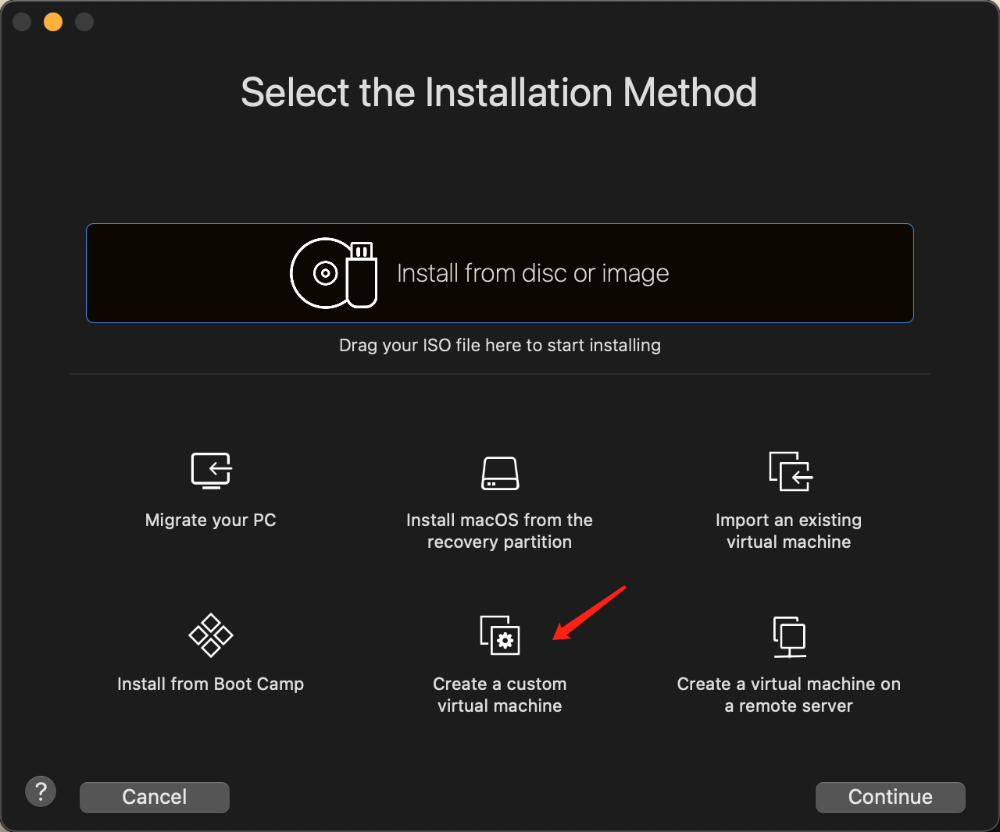
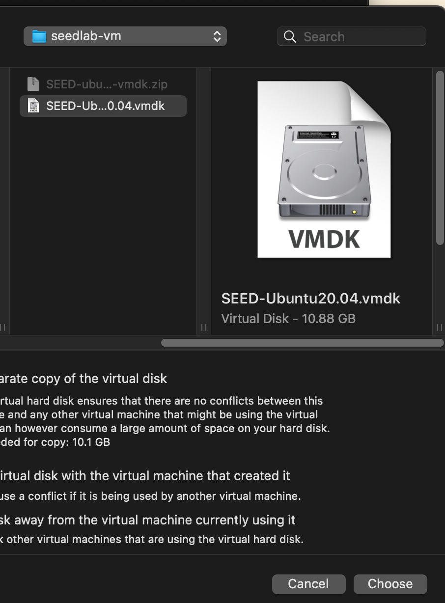

## Setup (VMWare)

1. Install VMWare
2. Download a pre-built SEED VM from [Box](https://uofu.box.com/s/qd1jgusug4d28vljy5es3ehrcsybz5pm)
3. Extract the VMDK file
4. Take VMWare Fusion as an example, click "New" - "Create a custom virtual machine". Continue, and select "Linux" - "Ubuntu 64 bit", continue 
5. Choose Firmware "Legacy BIOS", continue
6. Choose "Use an existing virtual disk" 
7. Continue, and finish.

The VM's USERNAME: seed, PASSWORD: dees